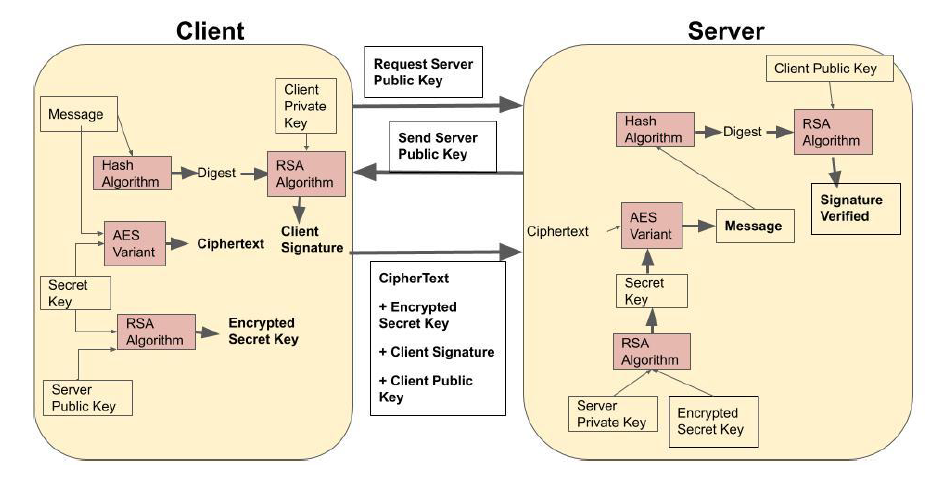
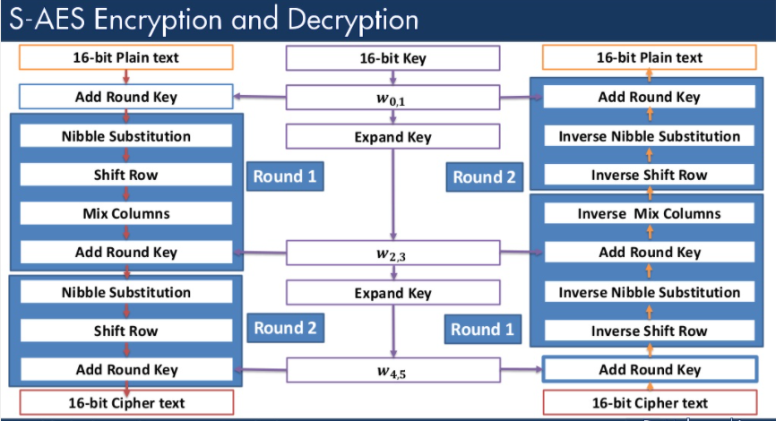

# Client and Server Application with Confidential Message Exchange

This is a Socket Program in which the Client encrypts a message using given key and the converted ciphertext message gets passed to the Server (on the same pc(network)) and then Server receive the encrypted message and the key. The Server then performs decryption operation on the received encrypted message using the key.

>Note: [__Simplified__ AES](https://github.com/adit098/AES-Cryptography) has been used for Encryption and Decryption.

***

***
The project contains 4 files: **RSA.py**, **SAES.py**, **Client.py**, and **Server.py**.
***

## **RSA.py**
This file contains all the functions and variables that is required for encrypting and decrypting the secret key using RSA algorithm and also for signing and verification of the message.




Above Image shows the full overview of the project which has been implemented.

## **SAES.py**
This file contains all the functions and varibles that is required for encrypting and decrypting the message using SAES algorithm.



**SAES.py** contains all the functions that is shown in the image above.

There are 2 rounds for Encryption and Decryption to be performed as we can see in the image.

Check **SAES.py** to see all the functions.
Functions used in **SAES.py**:-
1. encrypt [to encrypt the message]
2. decrypt [to decrypt the message]
3. keyExp [to Generate the three round keys]
4. shiftRow [to Shift Row]
5. sub4NibList [for Nibble substitution]
6. addKey [to Add Round Key]
7. vecToInt [to convert matrix into a single int value]
8. intToVec [Forming 2x2 matrix from int value]
9. conv_to_hexa [to convert the integer into hexadecimal]
10. mixCol [mix the column of 2x2 matrix using the constant matrix]
11. iMixCol [inverse of mixCol]

## **Client.py** 

We import the required function from **RSA.py** and **SAES.py** for the encryption of the secret key, creating message digest, signing & verrification of the message and encryption & decryption of the message in this file.


1. We first takes input for message, secret key, public Key Parameter and private Key Parameter. 
2. Then call function str2hash to get message digest from message. 
3. Then call function generate_keypair to get client side public key and private key.
4. Then call function get_signature to sign the message digest.
5. Then call *Keyexp* function to generate keys on the client side.Now we run a loop on the message and take 1 character at a time, *encrypt* it and then store it in a varable *ciphertext_list*.
6. Requested server to send its public key.
7. Now Client sends Encrypted Secret Key, Ciphertext, Message Digest, and Digital Signature to server to provide authentication, integrity and key sharing among both the client.
 


## **Server.py**

1. The Server receives the list of ciphertext messages, encrypted secret key, client signature and the client public key. 
2. Now get secret key using RSA Decryption function.
3. Now covert secret key list into int value by joining each item of secret key list.
4. Now again we call *Keyexp* function to generate keys on the Server side also(keys generated are same as on the client side). Then we call *decrpyt* function to decrypt the encrypted message from the *ciphertext_list* and store it in a variable *plaintext_list*.
5. Get original message from plaintext_list.
6. Get Message Digest from original message.
7. Now verfy the signature using client signature, client public key and message digest list.

>NOTE: All the values printed on the terminal on running the program will be in hexadecimal form.


## Run
First cd to the directory of code. Then run these commands-
```
python Server.py
python Client.py
```
